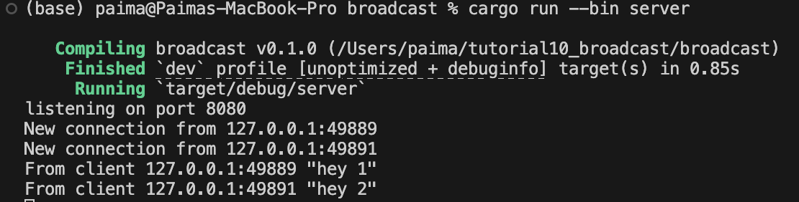
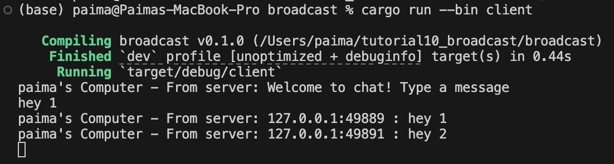
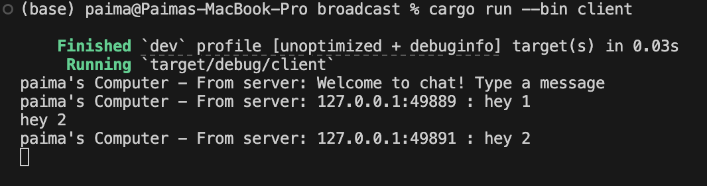

# Server

# Client 1

# Client 2

# Client 3

# Penjelasan
Server bertindak sebagai pusat komunikasi yang selalu siap menerima koneksi dari klien. Saat klien mengirim pesan, server menangkapnya melalui koneksi yang telah dibuka sebelumnya. Server lalu menyebarkan pesan tersebut ke semua klien yang terhubung, termasuk pengirimnya. Proses ini berlangsung cepat sehingga semua pengguna menerima pesan hampir secara bersamaan. Dengan begitu, percakapan tetap sinkron, real-time, dan terasa alami bagi semua pihak. Mekanisme ini juga mengurangi beban klien karena tidak perlu terus-menerus memeriksa apakah ada pesan baru yang masuk.

# 2.2. Modifying the websocket port
Ketika saya mengganti port di sisi klien menjadi 8080, klien otomatis mencoba menyambung ke WebSocket lewat port tersebut. Sementara itu, server masih mendengarkan koneksi di port 2000 karena belum disesuaikan. Akibat perbedaan ini, tidak ada layanan aktif di port 8080, sehingga klien selalu gagal terhubung dan menampilkan error “ConnectionRefused”. Meskipun klien terus mencoba menyambung ulang, hasilnya tetap sama. Setelah saya ubah port server agar juga menggunakan 8080, koneksi akhirnya berhasil dibangun. Dengan kedua pihak berada pada port yang sama, komunikasi kembali normal dan aplikasi dapat berfungsi sebagaimana mestinya.

# 2.3. Small changes. Add some information to client
# Server

# Client 1

# Client 2

Di tahap ini, kita mulai menyertakan identitas pengirim untuk setiap klien, berupa alamat IP dan nomor port mereka. Hal ini memungkinkan klien lain mengetahui asal pesan yang diterima. Dengan tambahan informasi ini, komunikasi menjadi lebih jelas dan terasa lebih personal. Untuk mengimplementasikannya, server perlu mengirim pesan yang sudah dilengkapi dengan data pengirim. Ini dilakukan dengan menyesuaikan cara pemanggilan bcast_tx.send. Perubahan tersebut dilakukan di file server.rs, tepatnya pada bagian yang menangani pesan masuk dari klien.
