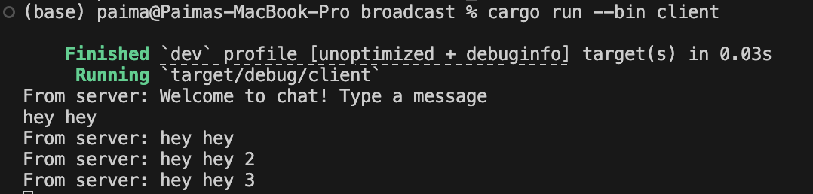

# Server

# Client 1

# Client 2

# Client 3

# Penjelasan
Server bertindak sebagai pusat komunikasi yang selalu siap menerima koneksi dari klien. Saat klien mengirim pesan, server menangkapnya melalui koneksi yang telah dibuka sebelumnya. Server lalu menyebarkan pesan tersebut ke semua klien yang terhubung, termasuk pengirimnya. Proses ini berlangsung cepat sehingga semua pengguna menerima pesan hampir secara bersamaan. Dengan begitu, percakapan tetap sinkron, real-time, dan terasa alami bagi semua pihak. Mekanisme ini juga mengurangi beban klien karena tidak perlu terus-menerus memeriksa apakah ada pesan baru yang masuk.